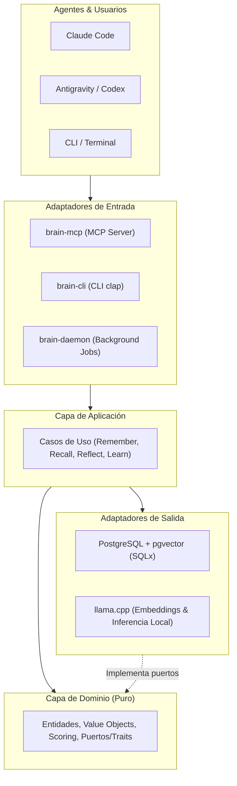

# 🧠 Local Brain

> **Memoria persistente local, agéntica y orientada a conocimiento para agentes de Inteligencia Artificial**

[](https://www.gnu.org/licenses/agpl-3.0)
[](https://www.rust-lang.org/)
[](#-estado-del-desarrollo-en-vivo)
[](#-arquitectura)
[-lightgrey.svg)](https://modelcontextprotocol.io/)

---

> [!IMPORTANT]
> ### 🛠️ Estado del Proyecto: En Desarrollo Activo Público (*Pre-Release / Alpha*)
> **Local Brain se construye en abierto desde el primer día.**  
> Este repositorio no esperará a estar terminado para publicarse: el código, la arquitectura, los tests y los debates de diseño evolucionan públicamente en tiempo real.  
> Puedes consultar el progreso detallado, las tareas pendientes y cómo sumarte en el [**Backlog del Proyecto**](file:///home/guty_3rrez/Proyectos/local-brain/BACKLOG.md).

---

## 🎯 Visión

Los agentes modernos de programación razonan y solucionan problemas con gran destreza, pero **pierden su experiencia entre sesiones y entre proyectos**. Los sistemas RAG tradicionales reducen la memoria a simples búsquedas de similitud en vectores:

```text
Documento → embedding → vector database → similarity search
```

Esto es insuficiente para capturar conocimiento experiencial real:
> *"Intentamos la solución A en el proyecto X, falló debido a Y, posteriormente migramos a la solución B y desde entonces preferimos B para este tipo de problema."*

**Local Brain** proporciona una infraestructura cognitiva local que permite a múltiples agentes de IA (Claude Code, Codex, Antigravity, etc.) compartir y enriquecer una memoria común mediante el protocolo **Model Context Protocol (MCP)**, manteniendo la privacidad, la trazabilidad y la propiedad absoluta de los datos en el hardware del usuario.

---

## 📊 Estado del Desarrollo en Vivo

Monitorea el avance de las fases definidas en la especificación formal ([`SRS — Local Brain`](file:///home/guty_3rrez/Proyectos/local-brain/SRS%20%E2%80%94%20Local%20Brain_%20Memoria%20persistente%20local%20para%20agentes%20de%20IA.md)):

| Fase | Nombre | Estado | Progreso | Alcance Clave |
| :--- | :--- | :---: | :---: | :--- |
| **Fase 0** | **Foundation & Governance** | 🟢 *Completado* | `[██████████] 100%` | Repositorio, AGPLv3, Backlog, Guías de Agentes, CI |
| **Fase 1** | **Memory Core (MVP)** | 🟢 *Completado* | `[██████████] 100%` | Dominio puro, PostgreSQL (SQLx), CRUD y CLI persistente |
| **Fase 2** | **Embeddings & Vector Search (MVP)** | 🟡 *En Progreso* | `[░░░░░░░░░░] 0%` | llama.cpp local, pgvector, búsqueda semántica |
| **Fase 3** | **Model Context Protocol (MCP) (MVP)** | ⚪ *Planificado* | `[░░░░░░░░░░] 0%` | Servidor MCP (stdio/SSE), tools para agentes de IA |
| **Fase 4** | **Especialización de Tipos de Memoria** | ⚪ *Planificado* | `[░░░░░░░░░░] 0%` | Working, Episodic, Semantic, Procedural, Associative |
| **Fase 5** | **Knowledge Graph & Relaciones** | ⚪ *Planificado* | `[░░░░░░░░░░] 0%` | Grafo tipado, traversal y relaciones semánticas |
| **Fase 6** | **Learning & Candidate Knowledge** | ⚪ *Planificado* | `[░░░░░░░░░░] 0%` | Observación vs Creencia, confidence scoring |
| **Fase 7** | **Consolidación & Reflexión** | ⚪ *Planificado* | `[░░░░░░░░░░] 0%` | `brain reflect`, clustering, contradicciones (`CONFLICT`) |
| **Fase 8** | **Advanced Hybrid Retrieval** | ⚪ *Planificado* | `[░░░░░░░░░░] 0%` | Pipeline híbrido, scoring multidimensional, olvido |
| **Fase 9** | **Hardening & Producción** | ⚪ *Planificado* | `[░░░░░░░░░░] 0%` | Modo offline, benchmarks p95 < 500ms, backup |

*Consulta el desglose completo de historias de usuario y criterios de aceptación en [BACKLOG.md](file:///home/guty_3rrez/Proyectos/local-brain/BACKLOG.md).*

---

## 🏛️ Arquitectura

El sistema aplica los principios de **Clean Architecture / Hexagonal Architecture**, garantizando que el dominio central sea totalmente independiente de motores de bases de datos, librerías de inferencia o protocolos externos:



---

## 💻 Hardware de Referencia (SRS §50)

Local Brain está diseñado para funcionar de manera ágil y fluida en hardware de consumo de gama media:

- **CPU:** AMD Ryzen 7 6800H (o equivalente x86_64).
- **RAM:** 16 GB DDR4/DDR5.
- **GPU:** NVIDIA GeForce RTX 3050 Laptop (4 GB VRAM) como hardware de referencia (o CPU pura con menor rendimiento).
- **Almacenamiento:** SSD NVMe.
- **S.O.:** Linux (desarrollo primario), Windows y macOS.

---

## 🧪 Arsenal de Testing

La calidad y la fiabilidad son prioritarias. El proyecto exige:
- **Unit Tests (`cargo test --lib`)**: Dominio puro aislado (sin DB, sin GPU, sin red, ejecución < 100 ms).
- **Integration Tests (`cargo test --test '*'`)**: Verificación de PostgreSQL + pgvector y protocolo MCP.
- **Mutation Testing (`cargo-mutants`)**: Validación de la eficacia del suite de tests (Mutation Score >= 80%).
- **BDD Testing (`cucumber-rs`)**: Especificaciones vivas en Gherkin (`tests/features/`).
- **Linter & Format**: `cargo fmt --check` y `cargo clippy -- -D warnings`.
- **Cobertura**: Reportes con `cargo-llvm-cov` (mínimo 85% en dominio).
- **Auditoría de Seguridad**: `cargo audit` y `cargo deny check`.

---

## 🤝 Cómo Colaborar

Agradecemos enormemente la colaboración de la comunidad (¡tanto de desarrolladores humanos como de agentes de IA!).

1. **Explora el Backlog**: Consulta [BACKLOG.md](file:///home/guty_3rrez/Proyectos/local-brain/BACKLOG.md) para encontrar tareas disponibles.
2. **Lee las Guías**:
   - Para contribuidores humanos y pautas generales: [CONTRIBUTING.md](file:///home/guty_3rrez/Proyectos/local-brain/CONTRIBUTING.md).
   - Para agentes de IA (normas estrictas y límites): [AGENTS.md](file:///home/guty_3rrez/Proyectos/local-brain/AGENTS.md).
   - Para Claude Code: [CLAUDE.md](file:///home/guty_3rrez/Proyectos/local-brain/CLAUDE.md).
3. **Reporta Problemas o Propuestas**: Utiliza las [Plantillas de Issues](file:///home/guty_3rrez/Proyectos/local-brain/.github/ISSUE_TEMPLATE) para reportar bugs, proponer mejoras o abrir discusiones arquitectónicas (ADRs).

---

## 📄 Licencia

Este proyecto está licenciado bajo la **GNU Affero General Public License v3.0 (AGPL-3.0-or-later)**.

> [!NOTE]
> La licencia AGPLv3 es una licencia de **copyleft fuerte**. Garantiza que Local Brain y cualquier mejora, derivación o integración ofrecida a través de redes y servicios continúen siendo **siempre software libre y de código abierto**. Consulta el archivo [LICENSE](file:///home/guty_3rrez/Proyectos/local-brain/LICENSE) para los términos completos.
